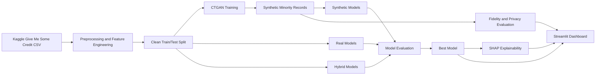

# Synthetic Financial Data Generation Using CTGAN for Credit Risk Assessment and Privacy-Preserving AI

Research-grade end-to-end project for the Kaggle **Give Me Some Credit** dataset. The system preprocesses credit-risk data, trains a CTGAN synthesizer, generates minority-class synthetic financial records, evaluates fidelity and privacy, trains credit default models, explains predictions with SHAP, and serves the workflow in a Streamlit dashboard.

## Architecture



## Project Structure

```text
.
├── app.py
├── requirements.txt
├── runtime.txt
├── setup.sh
├── data/
│   ├── raw/
│   ├── processed/
│   └── synthetic_data.csv
├── models/
├── notebooks/
│   └── EDA.ipynb
├── reports/
│   └── figures/
├── src/
│   ├── preprocessing.py
│   ├── train_ctgan.py
│   ├── train_models.py
│   ├── evaluate_synthetic.py
│   ├── privacy_fairness.py
│   ├── explainability.py
│   └── pipeline.py
├── streamlit_pages/
└── tests/
```

## Installation

```bash
python -m venv .venv
source .venv/bin/activate
python -m pip install --upgrade pip
python -m pip install -r requirements.txt
```

On Windows PowerShell:

```powershell
python -m venv .venv
.\.venv\Scripts\Activate.ps1
python -m pip install --upgrade pip
python -m pip install -r requirements.txt
```

## Dataset

Place Kaggle files in `data/raw/`. The training file must be:

```text
data/raw/cs-training.csv
```

This workspace was built from `D:\Evostra\GiveMeSomeCredit.zip`.

## Training

Run preprocessing:

```bash
python -m src.preprocessing
```

Train CTGAN and generate synthetic minority-class records:

```bash
python -m src.train_ctgan --epochs 300
```

Train Logistic Regression, Random Forest, and XGBoost across real, synthetic, and hybrid training sets:

```bash
python -m src.train_models
```

Evaluate synthetic fidelity:

```bash
python -m src.evaluate_synthetic
```

Run privacy, fairness, and SHAP explainability:

```bash
python -m src.privacy_fairness
python -m src.explainability
```

Or run the full pipeline:

```bash
python -m src.pipeline --ctgan-epochs 300
```

## Streamlit App

```bash
streamlit run app.py
```

Pages:

- Project Overview
- Data Analysis
- Synthetic Data Comparison
- Credit Risk Prediction
- Explainability
- Privacy & Fairness Metrics

## Streamlit Cloud Deployment

1. Push this repository to GitHub.
2. Add the Kaggle dataset or use a private data-loading workflow.
3. Confirm `requirements.txt` and `runtime.txt` are present.
4. In Streamlit Cloud, choose `app.py` as the entry point.
5. For production demos, pretrain models locally and include approved model artifacts, or run the training pipeline in a setup job.

## Outputs

Expected artifacts:

- `data/processed/train_clean.csv`
- `data/processed/test_clean.csv`
- `data/synthetic_data.csv`
- `models/ctgan.pkl`
- `models/best_model.pkl`
- `reports/model_metrics.csv`
- `reports/synthetic_quality_metrics.csv`
- `reports/privacy_fairness_metrics.json`
- `reports/figures/*.png`

## Results Summary

The modeling report ranks all real, synthetic, and hybrid experiments by ROC-AUC. Hybrid training is expected to improve minority-class recall when CTGAN-generated samples preserve the decision boundary and do not collapse distributions. Synthetic quality is assessed with KS tests, Wasserstein distance, correlation similarity, and histogram overlap. Privacy is approximated with Distance to Closest Record and a nearest-neighbor membership risk proxy.

## Screenshots

Add screenshots after running the dashboard:

- `assets/dashboard_overview.png`
- `assets/synthetic_comparison.png`
- `assets/prediction_page.png`
- `assets/privacy_fairness.png`

## Future Improvements

- Add Optuna hyperparameter optimization for CTGAN and XGBoost.
- Add SDMetrics full quality and diagnostic reports.
- Use differential privacy mechanisms for stronger formal privacy guarantees.
- Package the pipeline with MLflow experiment tracking.
- Add CI with linting, unit tests, and a small synthetic fixture dataset.
